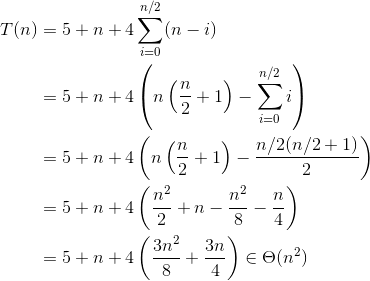

# Determinar Majoritário

Um vetor A[0..n-1] possui um elemento majoritário v se mais da metade dos elementos de A possuem o valor v. Determine o elemento majoritário v de um vetor A, ou retorne -1 se não existir. Assuma que os valores armazenados em A são não negativos.

Testando todas as possibilidades
A abordagem mais simples é contar quantas vezes o valor de cada elemento aparece no restante do vetor.
```pseudocodigo
MAJORITARIO_FORCA_BRUTA(A,n): pior caso
   para i de 0 até n/2           n/2+2
      cont <- 0                  n/2+1
      para j de i até n-1        n-i+1
         se A[i] == A[j]         n-i
            cont <- cont + 1     n-i
         se cont > n/2           n-i
            retorne A[i]         0
   retorne -1                    1
```

Pior caso:




No melhor caso os n/2+1 primeiros elementos são iguais, e o algoritmo encerra no passo 7 ainda na 1a iteração do primeiro 'for'. Portanto, no melhor caso o algoritmo é O(n).
Usando ordenação
Temos a opção de ordenar o vetor. Neste caso, se o elemento da posição i for igual ao elemento da posição i+n/2, sabemos que este valor ocupa mais da metade dos elementos.

MAJORITARIO_ORDENANDO(A,n):
   ordene o vetor A              n log n
   para i de 0 até (n-1)/2       (n-1)/2+2
      se A[i] == A[i+n/2]        (n-1)/2+1
         retorne A[i]            0
   retorne -1                    1
Concluímos que \(T(n) \in \Theta(n \lg n)\).

Obs.: Em C++, para ordenar um vetor A com n elementos basta incluir a biblioteca algorithm e executar std::sort(A,A+n).

Divisão e conquista
Para dividir o problema em problemas menores, precisamos da propriedade abaixo.

Quando dois elementos são distintos, podemos removê-los do problema sem alterar o majoritário (se houver majoritário).
Prova: Seja v majoritário e k seu número de ocorrências. Então, k > n/2. Mesmo que v seja um dos elementos removidos, ainda será majoritário nos n-2 restantes, pois \(k-1 > n/2 - 1 = (n-2)/2\).
Concluímos que após remover todos os pares de elementos distintos, o elemento restante é o majoritário. Se o vetor não tem majoritário, então pode sobrar um elemento não majoritário. Portanto, é necessário testar no final se o elemento que sobrou é de fato majoritário, mas isso pode ser feito em tempo linear.

O algoritmo consiste em dividir o vetor ao meio, resolver recursivamente, e analisar os elementos que sobraram em cada parte de vetor.

// Após cancelar pares de elementos distintos, resta apenas 'qte' elementos com o mesmo valor ('valor').
(qte,valor) <- MAJORITÁRIO_REC(A,ini,fim):
   se ini == fim, retorne (1, A[ini])                    1
   meior <- (ini+fim)/2                                  1
   (qte1,valor1) <- MAJORITÁRIO_REC(A,ini,meio)          T(n/2)
   (qte2,valor2) <- MAJORITÁRIO_REC(A,meio+1,fim)         T(n/2)
   se valor1 == valor2                                   1
      retorne (qte1+qte2, valor1)
   senão, se qte1 > qte2                                 1
      retorne (qte1-qte2, valor1)
   senão
      retorne (qte2-qte1, valor2)                        1

MAJORITARIO_DIVISAO_CONQUISTA(A,n):
   (qte,valor) <- MAJORITÁRIO_REC(A,0,n-1)               T(n)
   se qte > 0 e 'valor' ocorre em mais da metade de A    O(n)
      retorne valor
   retorne -1                                            1
$$T(n) = 2T(n/2) + 1 \in \Theta(n).$$
Recursão de cauda (iterativo)
Suponha que a chamada recursiva nos n-1 primeiros elementos retorna o valor que sobrou, e sua quantidade, após cancelar todos os pares de elementos distintos. Como incluir o último elemento A[n-1]? Seja (qte,valor) o par retornado pela chamada recursiva. Se 'valor' é igual ao último elemento, ou qte é igual a zero, retornamos (qte+1,A[n-1]). Senão, retornamos (qte-1,valor).

Como transformar em um algoritmo iterativo (para evitar estouro de pilha)? Considere o algoritmo abaixo:
MAJORITARIO_ITERATIVO(A,n):
   qte <- 0                                              1
   para i de 0 até n-1                                   n+1
      se qte == 0                                        n
         qte <- qte + 1
         valor <- A[i]
      senão
         se A[i] == valor, então qte <- qte + 1          1
         senão, qte <- qte - 1
   se qte == 0, retorne -1                               1
   se 'valor' ocorre em mais da metade de A              n
      retorne valor
   retorne -1                                            1
$$T(n) = 3n + 5 \in \Theta(n).$$
Implementação dos algoritmos
Modifique apenas o arquivo majoritario.cpp, implementando os protótipos fornecidos.

Para as instâncias de teste teremos as saídas abaixo (com tempos aproximados). Como você interpreta estes resultados? Por que o algoritmo iterativo foi o mais rápido na segunda instância, e o mais lento na primeira?

Forca bruta: -1, Tempo: 25.1268s
Ordenado: -1, Tempo: 0.014552s
Divisao e conquista: -1, Tempo: 0.003033s
Recursao de cauda (iterativo): -1, Tempo: 0.000796s

Forca bruta: 50000, Tempo: 0.002234s
Ordenado: 50000, Tempo: 0.014505s
Divisao e conquista: 50000, Tempo: 0.002993s
Recursao de cauda (iterativo): 50000, Tempo: 0.000702s
